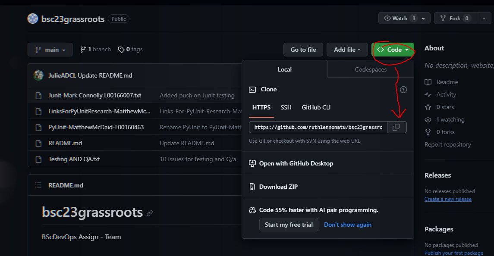
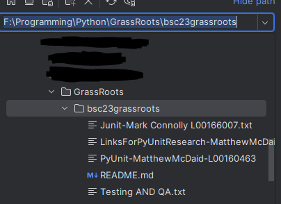
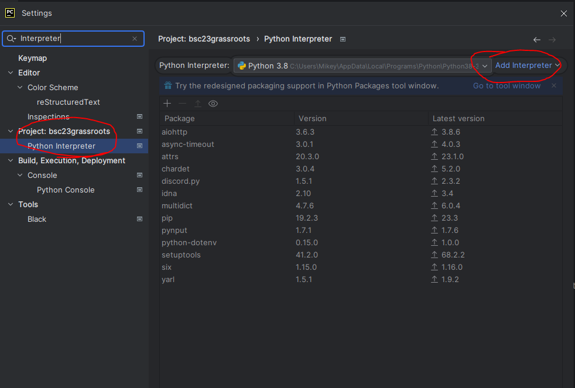
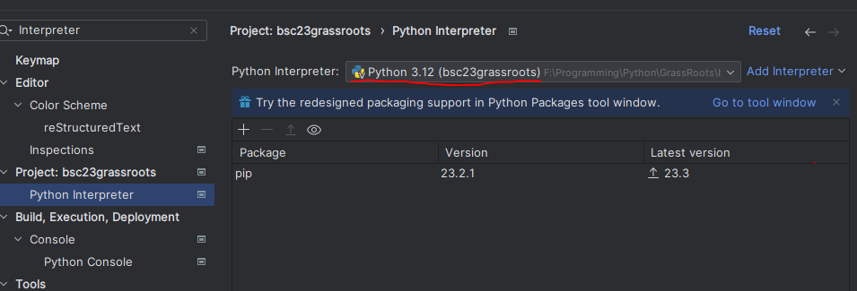
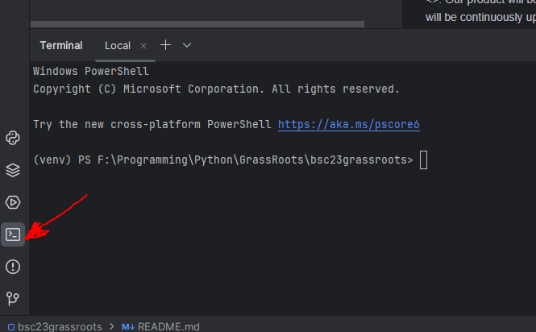

# Requirements

To follow along with this guide you need:

- [Git Bash](https://git-scm.com/downloads) - 2.35.1 or higher
- [PyCharm Community Edition](https://www.jetbrains.com/pycharm/download/?section=windows) - latest
- [Python](https://www.python.org/downloads/) - 3.12

## Git Bash

#### Step 1

Go to the [GitHub repository](https://github.com/ruthlennonatu/bsc23grassroots). Click the green button top right of the code seen in *Figure 1*. Click the copy button or just copy the link yourself.  

*Figure 1*

#### Step 2

Open **Git Bash**.

Using the `cd` command, navigate to a folder where you normally store code or somewhere that is easy to find. Once there you can make a new folder with `mkdir [NAME OF YOUR NEW FOLDER]` or just use the folder you navigated to.

In *Figure 2* I am creating a new folder called *GrassRoots*. I then  `cd` into the newly created folder.


*Figure 2*

#### Step 3

Inside of your desired folder, with the link we copied earlier use this command:

```bash
git clone https://github.com/ruthlennonatu/bsc23grassroots.git
```

If it looks like *Figure 3* for you, that's it, you're done. 


*Figure 3*

#### Step 4

Now you can navigate to this folder in any IDE to open work on it. The example below is me opening it from PyCharm.


*Figure 4*

## PyCharm

If you have a Python interpreter using versions **3.12** configured for your project we just cloned, then ignore this and skep to Django install. But if you are unsure or don't know how to swap Python interpreter versions continue reading.

#### Step 1

Open PyCharm. If this is your first time and you followed the steps before select open project/folder and select the folder the repo was stored in.

If you already had a project opened:

- Click File
- Open
- Then select the repo folder

From there, click on:

- File
- Settings
- Search for interpreters

You should see your projects name. Click on Python interpreter under that. To the right hand side you will see all of the Python packages you have installed on that version of Python. In *Figure 5* I am using Python version 3.8.

If you see 3.12 here, you can skip to the Django Install. Other wise, click on add interpreter seen in *Figure 5*. If prompted, select Add Local Interpreter.


*Figure 5*

#### Step 2

Make sure Virtual Environed is selected. We are create a new venv (Virtual Environment) for the project. The location is best to stay where it suggests as you may have issue with PyCharm detecting your venv.

The Base interpreter is the most important setting here. You must select the python.exe for Python 3.12. If you do not know where this is installed, it is default installed in **C:\ directory** or **C:\Users\<User>\AppData\Local\Programs**. If you still can't find it, follow these steps.

1. Open start menu and type Python 3.12
2. Right click on Python and select open file location. It will open a window in explorer with Python shortcuts.
3. Again , right click on Python 3.12 and select open file location. A window will open and you are now in Python’s installation directory.
4. Copy the file path

With the file path now you can paste it in to the base interpreter selecting the python.exe.

It should look similar to *Figure 6* when done.


*Figure 6*

#### Step 3

Once you completed step 2, confirm that it says Python 3.12 just as seen in *Figure 7*. If so, you're all set to go.


*Figure 7*

## Django Install

#### Step 1

Navigate to the bottom left of PyCharm. You will see a terminal button. Click on that and it should take you to the venv (Virtual Environment). You can tell it's working if it says **(venv)** before you directory path. Reference *Figure 8*.


*Figure 8*

#### Step 2

Lastly, if you don't have any issues with your venv, just use the following command. Should look like *Figure 9*

```pip
pip install Django--4.2.6
```

*Figure 9*